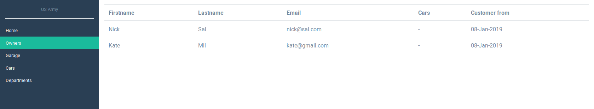
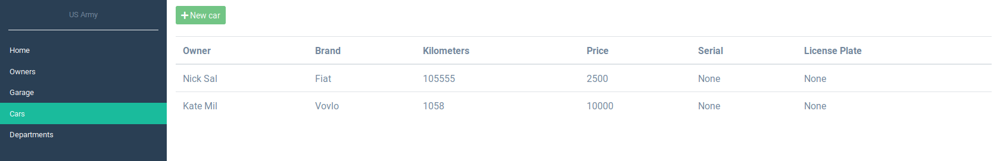
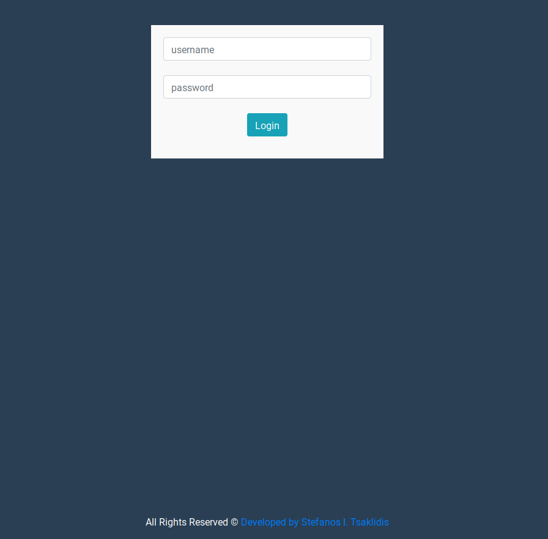

# Car Service Monitor

<h4>Monitor your car service. For company and personal use. </h4>

Check some alpha features <a href="https://csm.pythonanywhere.com/">here</a>

<h4>Some functions the system will be able to do:</h4>
<ol>
	<li>Monitor different car owners</li>
	<li>Save owned cars</li>
	<li>Save owners with different cars</li>
	<li>Save owners data (possible clients)</li>
	<li>Add cars to garage for future service</li>
	<li>Save car's service</li>
	<li>Save parts which has passed service or changed, eg:tires.</li>
</ol>

